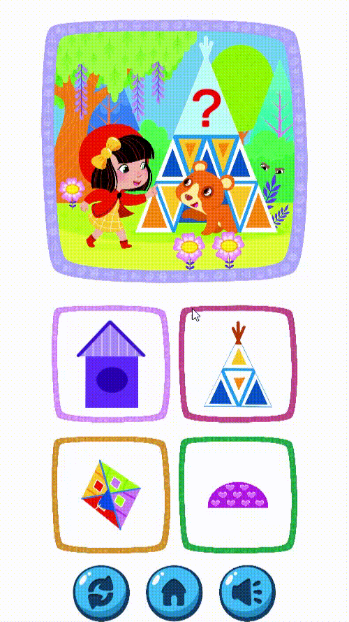

# ❤️ **Little Red Hood: The Land of Shapes**  
*A playful and educational shape-matching game for kids, built with Unity!*  

---

## 📖 **About the Game**  
**Little Red Hood: The Land of Shapes** is a delightful quiz-style game designed for children. Set in the charming world of **Little Red Riding Hood**, each scene presents a missing piece, and players must choose the correct shape to complete the picture!  

Developed for **Caramel Publishing**, creators of interactive books for children, this game blends storytelling, problem-solving, and fun in an engaging, educational experience.  

---

## 🚀 **Features**  
- 🔲 **Shape-Matching Gameplay**: Select the correct missing piece to complete the scene.  
- 🎨 **Beautiful Illustrations**: Colorful and engaging artwork inspired by classic fairy tales.  
- 🔊 **Interactive Sound Design**: Fun audio feedback for correct and incorrect answers.  
- 🧠 **Educational and Fun**: Encourages shape recognition and decision-making.  
- 📱 **Cross-Platform Support**: Play seamlessly on desktop, tablet, and mobile devices.  

---

## 💪 **Technologies Used**  
- **Unity**: The primary engine for building the game.  
- **C#**: Game logic and interactivity.  
- **2D Art & Animation**: Beautifully crafted visuals for an immersive experience.  

---

## 🎮 **How to Play**  
1. Look at the scene and identify the missing piece.  
2. Choose the correct shape.   
3. Play through multiple scenes and complete Little Red Hood’s adventure.  

---

## 🖌 **Showcase**  
Here's a sneak peek of **Little Red Hood: The Land of Shapes** in action:  

  
      

  

---

## 💌 **Acknowledgments**  
- Thanks to **Caramel Publishing** for inspiring creativity and learning in children!  
- Special thanks to the Unity community for their tools and resources.  
